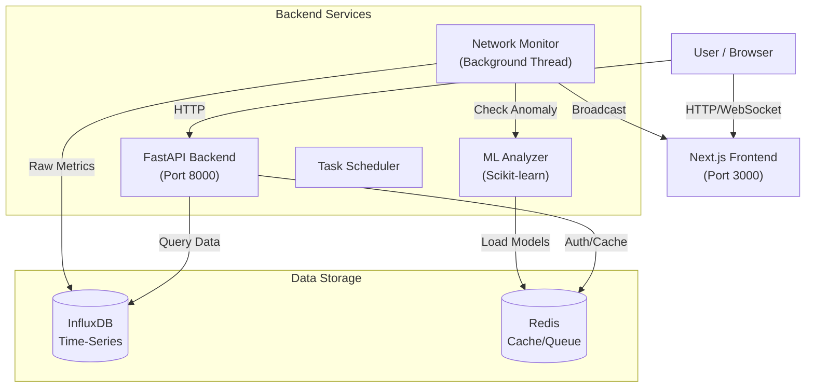
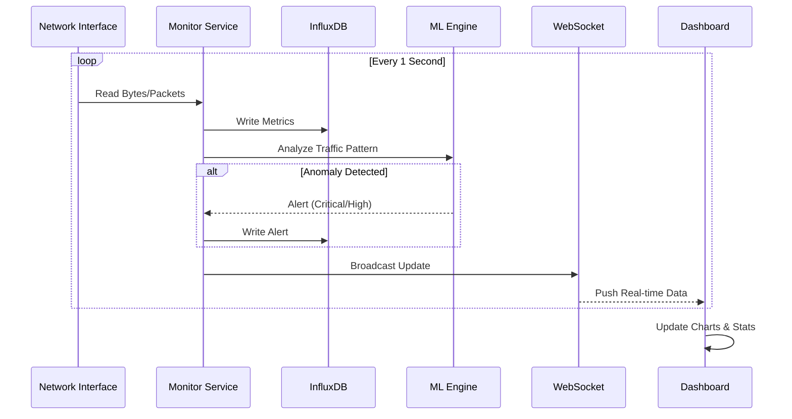

# Intelligent Network Traffic Analyzer - Project Handbook

## 1. Executive Summary
The **Intelligent Network Traffic Analyzer** is a real-time monitoring and anomaly detection system designed to inspect network traffic, visualize key metrics, and use Machine Learning to identify security threats. 

Built with a modern stack (Next.js, FastAPI, InfluxDB), it provides a responsive dashboard for network administrators to oversee traffic patterns, view historical data, and receive alerts for potential DDOS or intrusion attempts.

---

## 2. Architecture Overview

The system follows a microservices-based architecture, containerized with Docker.



### Component Breakdown
1.  **Frontend (Next.js 14)**: A React-based UI using Tailwind CSS and Recharts for visualization. It connects to the backend via REST API (for history/auth) and WebSocket (for real-time updates).
2.  **Backend (FastAPI)**: Python-based API server. It handles:
    *   **Traffic Monitoring**: Uses `psutil` to read network interface counters.
    *   **Data Ingestion**: Writes metrics to InfluxDB.
    *   **ML Analysis**: Runs Isolation Forest and Autoencoder models to detect anomalies.
    *   **WebSocket Manager**: Broadcasts live data to connected clients.
3.  **Database (InfluxDB)**: High-performance time-series database optimized for storing timestamped network metrics (bytes, packets, errors).
4.  **Cache (Redis)**: Used for caching high-frequency data and potentially message parameters.
5.  **Monitoring (Prometheus + Grafana)**: Optional sidecars for self-monitoring the application's performance.

---

## 3. Data Flow



---

## 4. Key Features & Implementation

### A. Real-Time Dashboard
*   **Tech**: Next.js, Framer Motion, Recharts.
*   **Location**: `intelligent-network-website/app/dashboard`
*   **Key Files**: 
    *   `LiveStatsCard.tsx`: Displays instant metrics (Bytes/sec, PPS).
    *   `RealTimeChart.tsx`: Rolling window chart of traffic volume.
    *   `useWebSocket.ts`: Custom hook managing the WS connection.

### B. Machine Learning Engine
*   **Tech**: Scikit-learn, Joblib.
*   **Models**:
    *   **Isolation Forest**: Unsupervised outlier detection.
    *   **Autoencoder**: Neural network-based reconstruction error detection.
*   **Location**: `network-monitor/src/ml`
*   **Implementation**: Models are trained on historical data and serialized to disk. The `AnomalyDetector` class loads them to score incoming traffic in real-time.

### C. Analytics Engine
*   **Tech**: InfluxDB Flux Queries.
*   **Feature**: Aggregates data over 24h, 7d, or 30d windows.
*   **Optimizations**: Uses InfluxDB's `spread()` and `sum()` functions to efficiently calculate total volume from cumulative counters.

### D. Authentication
*   **Tech**: OAuth2 with Password Flow (FastAPI).
*   **Credentials**: `admin` / `password`.
*   **Security**: Returns a JWT (Bearer token) used to secure API endpoints.

---

## 5. Project Directory Structure

```text
Intelligent Network Traffic Analyzer/
├── docker-compose.yml       # Orchestration for all services
├── network-monitor/         # Backend Service
│   ├── Dockerfile
│   ├── requirements.txt
│   ├── simulate_traffic.py  # Simulation Tool
│   └── src/
│       ├── api.py           # Main Application Entrypoint
│       ├── monitor.py       # Background Traffic Monitor
│       ├── database.py      # InfluxDB Interactions
│       ├── ml/              # Machine Learning Modules
│       │   ├── anomaly_detector.py
│       │   └── models/      # Serialized Model Files
│       └── ...
└── intelligent-network-website/  # Frontend Service
    ├── package.json
    ├── tailwind.config.ts
    ├── app/
    │   ├── page.tsx         # Landing Page
    │   ├── login/           # Login Page
    │   └── dashboard/       # Protected Dashboard Area
    │       ├── analytics/
    │       ├── ml-models/
    │       └── alerts/
    └── components/          # Reusable UI Components
```

---

## 6. Operation Guide

### Running the Application

**Option A: Full Docker (Recommended for Prod)**
This runs the database, backend, and a production build of the frontend.
```bash
docker-compose up -d --build
```
*Access at: http://localhost:3000*

**Option B: Hybrid Dev Mode (Recommended for Development)**
Run the backend in Docker (for database dependencies) and frontend locally.

1.  **Start Backend Services**:
    ```bash
    docker-compose up -d influxdb redis backend
    ```
2.  **Start Frontend**:
    ```bash
    cd intelligent-network-website
    npm install
    npm run dev
    ```
*Access at: http://localhost:3000*

### Simulating Network Traffic
To test the ML alerts, use the included Python script to generate traffic bursts.

```bash
# From the project root
cd network-monitor
python3 simulate_traffic.py
```
*   **Option 1**: Normal Traffic (10 req/s) - Good for baseline.
*   **Option 2**: High Traffic Spike (100 req/s) - Triggers "High Traffic" alerts.
*   **Option 3**: Anomaly (500 req/s) - Triggers ML-based "Critical" alerts.

---

## 7. Troubleshooting

| Issue | Logic / Solution |
| :--- | :--- |
| **"System Offline" / WebSocket Error** | Backend is not running or port 8000 is blocked. Check `docker ps`. |
| **ML Tab Empty** | Models not trained or paths incorrect. Run valid traffic to generate training data. |
| **Dark Mode Not Working** | Older Tailwind versions. Ensure `globals.css` uses HSL variables (Fixed in v2). |
| **Port 3000 Conflict** | You are running `npm run dev` AND `docker-compose up` simultaneously. Stop one. |

---

## 8. Cloud Deployment Guide

This project supports a hybrid cloud deployment model.

### Architecture

*   **Backend**: Hosted on **Google Cloud Run** (Serverless Container).
*   **Frontend**: Hosted on **Google Cloud Run** (Serverless Container).
*   **Database**: Users must provide an external InfluxDB instance (e.g., InfluxDB Cloud or a VM).

### A. Backend Deployment (Cloud Run)

1.  **Containerization**:
    The generic `Dockerfile` is optimized for Cloud Run:
    *   Uses `PORT` environment variable (default 8000).
    *   Conditional `ENABLE_MONITOR` flag to disable background monitoring (since Cloud Run scales to zero).

2.  **Configuration**:
    Set the following environment variables in Cloud Run:
    *   `INFLUX_URL`: URL of your InfluxDB instance.
    *   `INFLUX_TOKEN`: Authentication token.
    *   `INFLUX_ORG` / `INFLUX_BUCKET`: Database details.
    *   `ENABLE_MONITOR`: `false` (Recommended for serverless to save costs/avoid zombie threads).

### B. Frontend Deployment (Cloud Run)

The frontend is also hosted on Cloud Run to support dynamic features and simplified routing.

1.  **Containerization**:
    *   Uses a multistage `Dockerfile` with `node:20-alpine`.
    *   Configures Next.js for `output: 'standalone'`.

2.  **Deployment Commands**:
    ```bash
    cd intelligent-network-website
    
    # Submit Build to Artifact Registry
    gcloud builds submit --tag us-central1-docker.pkg.dev/netsentry-487419/cloud-run-source-deploy/frontend-nextjs
    
    # Deploy Service
    gcloud run deploy frontend-service \
      --image us-central1-docker.pkg.dev/netsentry-487419/cloud-run-source-deploy/frontend-nextjs \
      --platform managed \
      --region us-central1 \
      --allow-unauthenticated
    ```

  --allow-unauthenticated
    ```

3.  **Access**:
    The site is available at your Cloud Run URL (e.g., `https://frontend-service-....run.app`).

---

## 9. Data Ingestion API

To feed real-time data into the system (e.g., from a remote probe or script), use the `/api/v1/ingest` endpoint.

### Endpoint Details
*   **URL**: `POST /api/v1/ingest`
*   **Headers**: 
    *   `Content-Type: application/json`
    *   `X-API-Key`: `your_secret_key` (Default: `secret-api-key`, configurable via `API_KEY` env var)

### Payload Format
The body should be a JSON object with a `metrics` array:

```json
{
  "metrics": [
    {
      "interface": "eth0",
      "bytes_sent": 1024,
      "bytes_recv": 2048,
      "packets_sent": 10,
      "packets_recv": 20,
      "err_in": 0,
      "err_out": 0,
      "drop_in": 0,
      "drop_out": 0,
      "timestamp": "2023-10-27T10:00:00Z" 
    }
  ]
}
```

### Example Usage (cURL)

```bash
curl -X POST "https://backend-SERVICE-URL.run.app/api/v1/ingest" \
  -H "Content-Type: application/json" \
  -H "X-API-Key: secret-api-key" \
  -d '{
    "metrics": [
      {
        "interface": "eth0",
        "bytes_sent": 5000,
        "bytes_recv": 12000,
        "packets_sent": 50,
        "packets_recv": 120,
        "err_in": 0,
        "err_out": 0,
        "drop_in": 0,
        "drop_out": 0
      }
    ]
  }'
```
